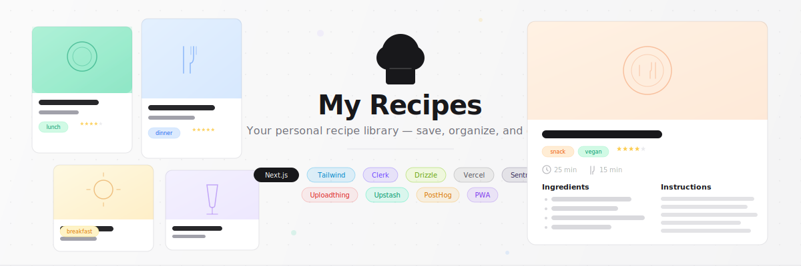
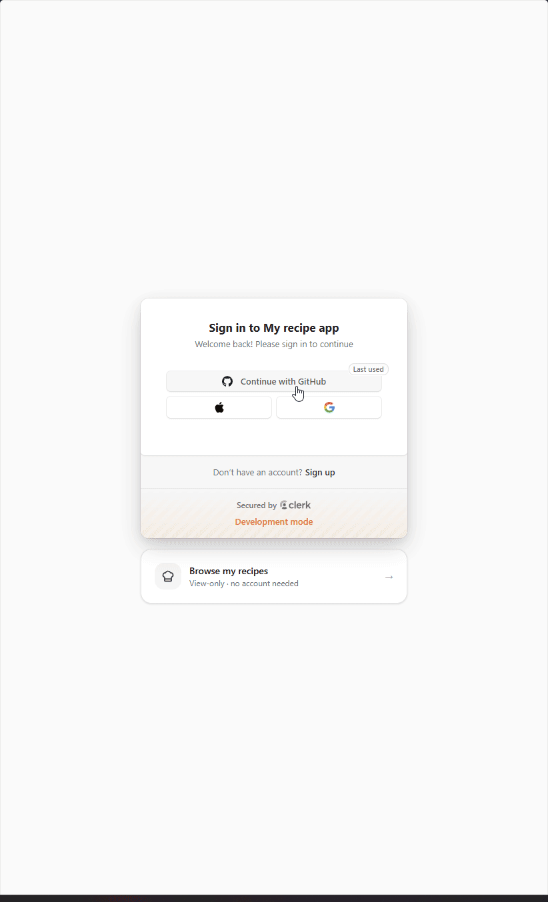
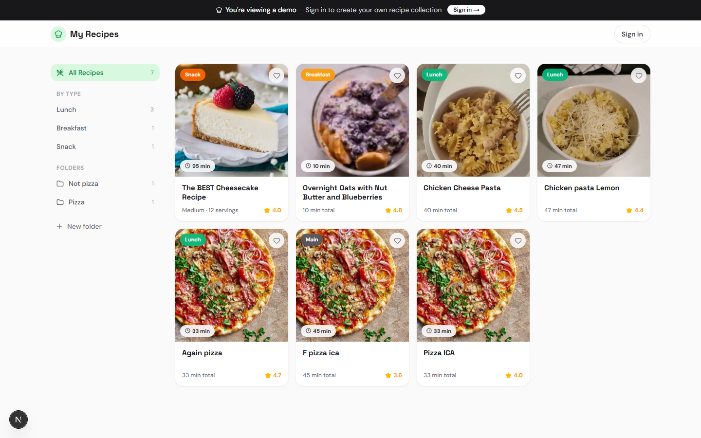
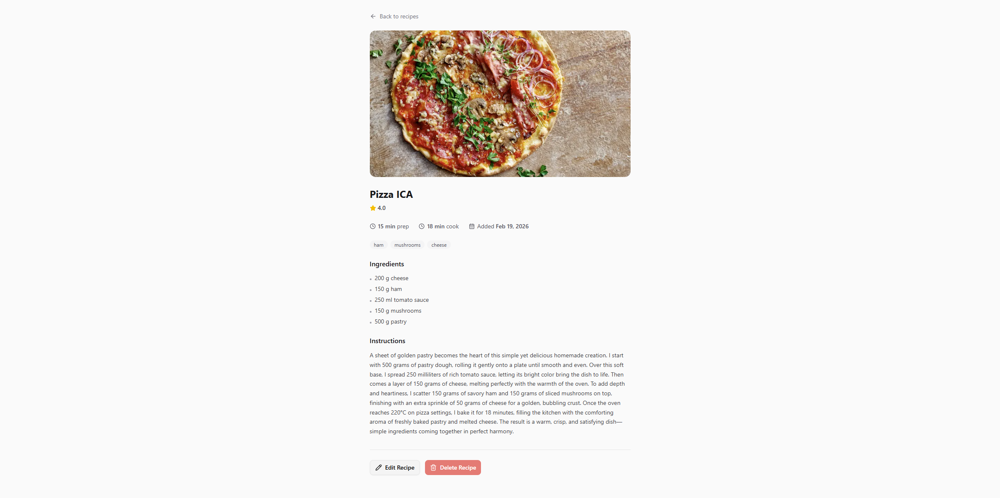
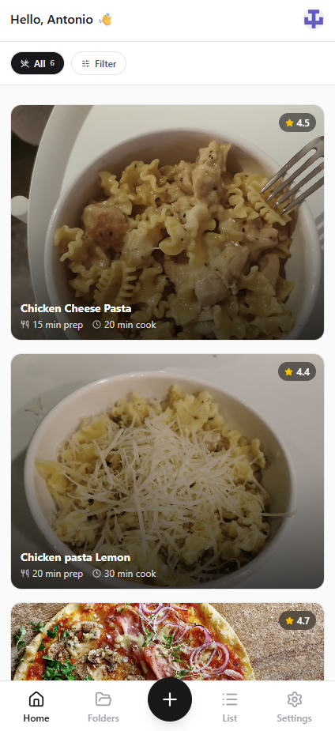
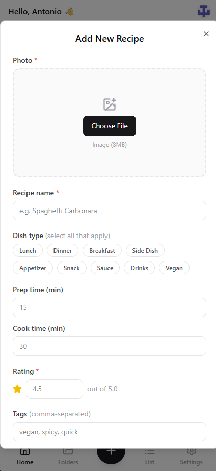

<p align="center">
  
</p>

<p align="center">
  
  
  
  
  
  
  
  
  
  
</p>

<p align="center">
  <a href="#-demo">Live Demo</a> · <a href="#-getting-started">Getting Started</a> · <a href="#-features">Features</a> · <a href="#-project-structure">Project Structure</a>
</p>

---

<!-- Replace with your actual GIF recording -->
<p align="center">
  
</p>

## Table of Contents

- [Demo](#-demo)
- [Features](#-features)
- [Screenshots](#-screenshots)
- [Tech Stack](#-tech-stack)
- [Getting Started](#-getting-started)
  - [Prerequisites](#prerequisites)
  - [Installation](#installation)
  - [Environment Variables](#environment-variables)
  - [Database Setup](#database-setup)
- [Usage](#-usage)
- [Project Structure](#-project-structure)
- [Service Integrations](#-service-integrations)
- [Deployment](#-deployment)

---

## Demo

A public demo is available at `/demo` — no account required. Visitors can browse real recipes in read-only mode to see the full UI without signing up.

> **[Try the live demo &rarr;](https://your-app.vercel.app/demo)**

---

## Features

- **[Pinterest-style recipe grid](src/components/recipe-grid.tsx)** — responsive masonry layout (1→2→3→4 columns) with hero images, dish type badges, star ratings, and prep/cook times
- **[Full recipe detail page](src/app/recipe/[id]/page.tsx)** — ingredients list, step-by-step instructions, metadata, and hero image
- **[Add & edit recipes](src/components/recipe-upload-dialog.tsx)** — structured form with image upload, dynamic ingredient rows, multi-select dish types, tags, and folder assignment
- **[Folder organization](src/components/folder-sidebar.tsx)** — create folders, filter the grid by folder, and view recipe counts per folder
- **[Multi-select & batch move](src/components/recipe-grid.tsx)** — select multiple recipe cards and move them to a folder in one action
- **[Mobile filter bar](src/components/mobile-filter-bar.tsx)** — bottom sheet with cook time range, dish type chips, and folder filters
- **[Public demo mode](src/app/demo/page.tsx)** — unauthenticated visitors browse your real recipes read-only via a `DEMO_CLERK_ID` environment variable
- **[PWA install prompt](src/components/install-banner.tsx)** — smart banner with 2-day dismissal cooldown; Android uses native install prompt, iOS shows step-by-step instructions
- **[OAuth authentication](src/proxy.ts)** — GitHub, Google, and Apple sign-in via Clerk middleware
- **[Rate limiting](src/lib/ratelimit.ts)** — Upstash Redis protects upload (10/hr) and delete (20/hr) endpoints
- **[Error monitoring](src/instrumentation.ts)** — Sentry captures server action errors, request errors, and client-side exceptions
- **[Analytics](src/components/posthog-provider.tsx)** — PostHog tracks pageviews and auto-identifies authenticated users

---

## Screenshots

<!-- REPLACE these placeholders with your actual screenshots -->

<table>
  <tr>
    <td align="center" width="50%">
      <strong>Recipe Grid (Desktop)</strong><br /><br />
      
    </td>
    <td align="center" width="50%">
      <strong>Recipe Detail (Desktop)</strong><br /><br />
      
    </td>
  </tr>
  <tr>
    <td align="center">
      <strong>Recipe Grid (Mobile)</strong><br /><br />
      
    </td>
    <td align="center">
      <strong>Add Recipe Form (Mobile)</strong><br /><br />
      
    </td>
  </tr>
</table>

---

## Tech Stack

| Concern          | Tool                          | Why                                                                 |
| ---------------- | ----------------------------- | ------------------------------------------------------------------- |
| Framework        | Next.js 16 (App Router)       | Server components by default, server actions for all mutations      |
| Language         | TypeScript 5                  | End-to-end type safety from database schema to UI props             |
| Styling          | Tailwind CSS v4 + shadcn/ui   | Utility-first CSS with accessible, pre-built component primitives   |
| Database         | Neon Postgres + Drizzle ORM   | Serverless Postgres with type-safe queries — zero raw SQL           |
| Auth             | Clerk                         | Drop-in OAuth (GitHub, Google, Apple) with middleware route protection |
| File Upload      | Uploadthing                   | Type-safe uploads with built-in CDN — one hero image per recipe     |
| Error Monitoring | Sentry                        | Server action, edge, and client error capture with source maps      |
| Analytics        | PostHog                       | Privacy-friendly product analytics with auto user identification    |
| Rate Limiting    | Upstash Redis                 | Serverless Redis — sliding window limits on upload and delete       |
| PWA              | next-pwa                      | Service worker, manifest, and aggressive caching for mobile install |
| Deployment       | Vercel                        | Zero-config deploys, edge middleware, serverless functions           |

---

## Getting Started

### Prerequisites

- **Node.js** 18+
- **pnpm** (this project does not support npm or yarn)

### Installation

```bash
# Clone the repository
git clone https://github.com/your-username/my-recipe-app.git
cd my-recipe-app

# Install dependencies
pnpm install

# Set up environment variables
cp .env.example .env.local
# Fill in your values (see table below)

# Push the database schema
pnpm db:push

# Start the dev server
pnpm dev
```

Open [http://localhost:3000](http://localhost:3000).

### Environment Variables

```env
# Database
POSTGRES_URL=

# Clerk
NEXT_PUBLIC_CLERK_PUBLISHABLE_KEY=
CLERK_SECRET_KEY=

# Uploadthing
UPLOADTHING_SECRET=
UPLOADTHING_APP_ID=

# Sentry
SENTRY_DSN=
SENTRY_ORG=
SENTRY_PROJECT=
SENTRY_AUTH_TOKEN=

# PostHog
NEXT_PUBLIC_POSTHOG_KEY=
NEXT_PUBLIC_POSTHOG_HOST=https://us.i.posthog.com

# Upstash
UPSTASH_REDIS_REST_URL=
UPSTASH_REDIS_REST_TOKEN=

# Demo mode (optional)
DEMO_CLERK_ID=
```

| Variable | Description | Where to Get It |
| -------- | ----------- | --------------- |
| `POSTGRES_URL` | Neon Postgres connection string | [neon.tech](https://neon.tech) → project → connection details |
| `NEXT_PUBLIC_CLERK_PUBLISHABLE_KEY` | Clerk frontend key | [clerk.com](https://clerk.com) → project → API keys |
| `CLERK_SECRET_KEY` | Clerk backend key | Same Clerk dashboard page |
| `UPLOADTHING_SECRET` | Uploadthing API secret | [uploadthing.com](https://uploadthing.com) → project → API keys |
| `UPLOADTHING_APP_ID` | Uploadthing app identifier | Same Uploadthing dashboard page |
| `SENTRY_DSN` | Sentry data source name | [sentry.io](https://sentry.io) → project → settings → client keys |
| `SENTRY_ORG` | Sentry organization slug | Sentry → settings → organization |
| `SENTRY_PROJECT` | Sentry project slug | Sentry → settings → project |
| `SENTRY_AUTH_TOKEN` | Sentry auth token for source maps | Sentry → settings → auth tokens |
| `NEXT_PUBLIC_POSTHOG_KEY` | PostHog project API key | [posthog.com](https://posthog.com) → project → settings |
| `NEXT_PUBLIC_POSTHOG_HOST` | PostHog ingestion host | Defaults to `https://us.i.posthog.com` |
| `UPSTASH_REDIS_REST_URL` | Upstash Redis REST endpoint | [upstash.com](https://upstash.com) → database → REST API |
| `UPSTASH_REDIS_REST_TOKEN` | Upstash Redis REST token | Same Upstash dashboard page |
| `DEMO_CLERK_ID` | Your Clerk user ID (enables `/demo`) | Clerk → Users → your account → user ID (starts with `user_`) |

### Database Setup

```bash
# Push Drizzle schema to your Neon database
pnpm db:push

# Open Drizzle Studio to browse/edit data
pnpm db:studio
```

---

## Usage

Once the app is running:

1. **Sign in** — visit the home page and authenticate with GitHub, Google, or Apple
2. **Add a recipe** — tap the **+** button, upload a photo, fill in the name, dish types, ingredients, instructions, prep/cook times, and rating
3. **Browse your grid** — recipes appear as cards in a responsive Pinterest-style grid with hero images and metadata
4. **Filter** — use the sidebar (desktop) or filter bar (mobile) to narrow by folder, dish type, or cook time range
5. **View details** — click any card to see the full recipe with ingredients and instructions
6. **Edit a recipe** — on the detail page, tap the pencil icon to update any field including the photo
7. **Organize into folders** — create folders from the sidebar, then multi-select recipe cards and batch-move them
8. **Delete** — on the detail page, tap the trash icon and confirm
9. **Install on mobile** — when visiting on a phone, a banner prompts to install the app to the home screen

Visitors who don't have an account can tap **"Browse my recipes"** on the sign-in page to access the read-only demo.

---

## Project Structure

```
src/
├── app/
│   ├── layout.tsx                  # Root layout — Clerk, PostHog, Toaster, Geist font
│   ├── page.tsx                    # Home — server component, fetches recipes & folders
│   ├── globals.css                 # Tailwind v4 theme (light + dark CSS variables)
│   ├── manifest.ts                 # PWA manifest (name, icons, display mode)
│   ├── recipe/[id]/page.tsx        # Recipe detail — ingredients, instructions, edit/delete
│   ├── folders/page.tsx            # Folder management page
│   ├── demo/                       # Public demo routes (unauthenticated)
│   │   ├── page.tsx                # Demo grid — reads owner's recipes via DEMO_CLERK_ID
│   │   └── recipe/[id]/page.tsx    # Demo recipe detail (read-only)
│   ├── sign-in/[[...sign-in]]/     # Clerk sign-in + demo link
│   ├── sign-up/[[...sign-up]]/     # Clerk sign-up
│   └── api/uploadthing/route.ts    # Uploadthing webhook handler
├── components/
│   ├── ui/                         # shadcn/ui primitives (Button, Dialog, Sheet, Badge…)
│   ├── home-client.tsx             # Main app shell — header, grid, sidebar, nav
│   ├── recipe-card.tsx             # Grid card — image, badges, rating, times
│   ├── recipe-grid.tsx             # Responsive grid with multi-select & batch move
│   ├── recipe-detail.tsx           # Full recipe view — hero, ingredients, instructions
│   ├── recipe-upload-dialog.tsx    # Add/edit form — image upload, dynamic ingredients
│   ├── edit-recipe-button.tsx      # Opens upload dialog in edit mode
│   ├── delete-recipe-button.tsx    # Confirm dialog + server action
│   ├── folder-sidebar.tsx          # Desktop sidebar — folders, dish types, counts
│   ├── folders-client.tsx          # Folder management grid
│   ├── mobile-filter-bar.tsx       # Mobile bottom sheet filters
│   ├── bottom-nav.tsx              # Mobile tab bar (Home, Folders, Add, List, Settings)
│   ├── install-banner.tsx          # PWA install prompt (Android + iOS)
│   ├── ios-install-sheet.tsx       # iOS "Add to Home Screen" instructions
│   ├── demo-banner.tsx             # Sticky banner for demo mode
│   └── posthog-provider.tsx        # PostHog init + user identification
├── hooks/
│   └── use-install-prompt.ts       # beforeinstallprompt capture, iOS detect, install trigger
├── lib/
│   ├── db/
│   │   ├── index.ts                # Drizzle client (Neon HTTP, server-only)
│   │   ├── schema.ts               # Users, recipes, folders tables + types
│   │   └── queries.ts              # getRecipes, getFolders, getOrCreateUser, getDemoUser
│   ├── ratelimit.ts                # Upstash rate limiters (upload: 10/hr, delete: 20/hr)
│   ├── uploadthing.ts              # File router (recipeImage, 8MB max, auth middleware)
│   ├── uploadthing-client.ts       # Generated UploadButton & UploadDropzone
│   ├── demo-data.ts                # Static fallback recipes for demo mode
│   └── utils.ts                    # cn() — clsx + tailwind-merge
├── server/actions/
│   ├── recipes.ts                  # createRecipe, updateRecipe, deleteRecipe, addToFolder
│   └── folders.ts                  # createFolder
├── instrumentation.ts              # Sentry onRequestError + runtime-specific init
└── proxy.ts                        # Clerk middleware — public vs protected route matcher
```

---

## Service Integrations

### Neon Postgres + Drizzle ORM

All data is stored in a serverless Neon Postgres database. Drizzle ORM provides type-safe queries inferred directly from the schema — no raw SQL anywhere in the codebase. The schema defines three tables: `users`, `recipes`, and `folders`, with cascade deletes and array columns for tags, dish types, and folder assignments. See [src/lib/db/schema.ts](src/lib/db/schema.ts) and [src/lib/db/queries.ts](src/lib/db/queries.ts).

### Clerk Authentication

Clerk handles OAuth sign-in (GitHub, Google, Apple) and session management. A middleware in [src/proxy.ts](src/proxy.ts) protects all routes except sign-in, sign-up, and demo pages. Server components use `currentUser()` to fetch the authenticated user; client components use `useUser()`. The `UserButton` component provides profile management and sign-out.

### Uploadthing

Recipe hero images are uploaded through Uploadthing's type-safe file router. The router in [src/lib/uploadthing.ts](src/lib/uploadthing.ts) enforces a single image per recipe (8MB max) and verifies authentication via Clerk before accepting uploads. Images are served from Uploadthing's CDN and rendered with `next/image` for optimization.

### Sentry

Error monitoring is initialized across three runtimes — server ([sentry.server.config.ts](sentry.server.config.ts)), client ([sentry.client.config.ts](sentry.client.config.ts)), and edge ([sentry.edge.config.ts](sentry.edge.config.ts)). Server actions in [src/server/actions/](src/server/actions/) catch errors and call `Sentry.captureException()`. The [instrumentation hook](src/instrumentation.ts) provides automatic request error capture.

### PostHog

Product analytics are initialized in [src/components/posthog-provider.tsx](src/components/posthog-provider.tsx), which wraps the app in a client-side provider. It auto-identifies authenticated Clerk users (ID, name, email, avatar) and tracks pageviews and page leaves. The provider registers the `app` property for filtering in the PostHog dashboard.

### Upstash Redis

Rate limiting is implemented in [src/lib/ratelimit.ts](src/lib/ratelimit.ts) using Upstash's serverless Redis. Two sliding window limiters protect mutations: uploads are limited to 10 per hour and deletes to 20 per hour, keyed by user ID. Both `createRecipe` and `deleteRecipe` server actions check the limiter before executing.

---

## Deployment

The app is configured for **Vercel** with zero-config deploys on push.

```bash
# Install Vercel CLI
pnpm add -g vercel

# Deploy
vercel
```

> **Important:** Add all environment variables from the table above to your Vercel project settings before deploying. The `SENTRY_AUTH_TOKEN` is required at build time for source map uploads. `DEMO_CLERK_ID` is optional — the demo page falls back to static sample data if it's not set.

---

<p align="center">
  Built with <strong>Next.js</strong>, <strong>Tailwind CSS</strong>, <strong>Drizzle ORM</strong>, and <strong>Clerk</strong> — deployed on <strong>Vercel</strong>.
</p>
